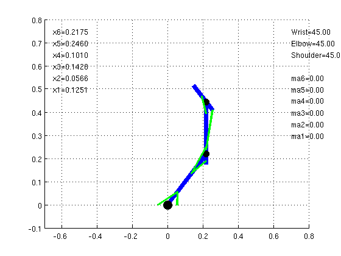

Arm models
==========

These arm models were developed in MapleSim 5 and exported to Simulink.

Each arm has a `run.m` script. Run it.

## 3 link arm

## 3 link 6 muscle arm

## 3 link 9 muscle arm

